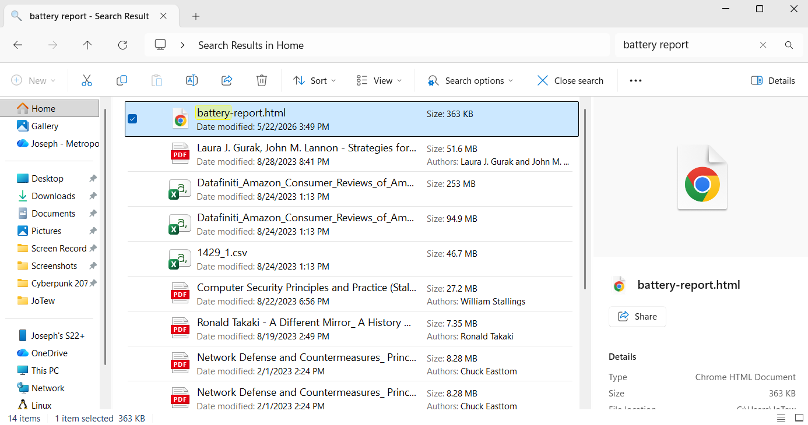

# Dell Laptop Battery Replacement Guide

> A complete walkthrough of replacing the internal battery in a Dell laptop, including preparation, disassembly, troubleshooting unexpected issues, installation of a replacement battery, and post-repair validation.

## Overview

This project documents the entire process of replacing the internal battery in my Dell Inspiron 15 5502 Laptop. The goal was to restore battery performance while documenting the repair process, troubleshooting steps, and lessons learned throughout the replacement. 

During the repair, several challenges are encountered, including stripped battery mounting screws that required additional troubleshooting before the battery could be removed successfully.

This guide is intended to serve as both a repair reference and a hardware troubleshooting case study.

---

## Device Information

| Item | Details |
|--------|--------|
| Device | Dell Inspiron 15 5502 |
| Repair Type | Internal Battery Replacement |
| Battery Type | [Dell Internal Lithium-Ion H5CKD 53Wh Battery](https://www.amazon.com/dp/B0C81TT1XK?ref=ppx_yo2ov_dt_b_fed_asin_title&th=1) |
| Repair Difficulty | Intermediate |
| Outcome | Successful Battery Replacement |

---

## Why the Battery Needed Replacement

Over time, lithium-ion batteries naturally lose capacity and become less effective at holding a charge.

Common indicators included:
- **Reduced battery life**
- **More frequent charging**
- **Faster battery drain**
- **General battery aging**

After about 5 years of having this laptop, I realized that the battery needed replacing as it would only last about 50 minutes with a full charge at 80% and need to be on the charge multiple times.

Replacing the battery restores portability and improves overall device usability.

---

## Tools and Materials

The following lists below are tools and materials that I used throughout this entire repair/replacement process for the battery. Some tools were effective while others did not help with troubleshooting and replacing the battery.

### Repair Tools:

- [Precision Screwdriver Kit](https://www.amazon.com/dp/B0D633J3C7?ref=ppx_yo2ov_dt_b_fed_asin_title)
- Plastic Pry Tools
- Tweezers
- Needle-nose pilers
- [Screw Extractor Kit](https://www.amazon.com/dp/B0BTNT4225?ref=ppx_yo2ov_dt_b_fed_asin_title)
- [Mini Grinding Pen](https://www.amazon.com/dp/B0DBLHGRQL?ref=ppx_yo2ov_dt_b_fed_asin_title)

### Safety Materials:

- Painter's Tape
- Protective Barriers
- Compressed Air
- Paper Towels

### Replacement Parts:

- [Compatible H5CKD 53Wh Dell Laptop Battery](https://www.amazon.com/dp/B0C81TT1XK?ref=ppx_yo2ov_dt_b_fed_asin_title)
- [Laptop Computer Screw Kit](https://www.amazon.com/dp/B0B5CY5LY5?ref=ppx_yo2ov_dt_b_fed_asin_title)

---

## Step 1: Verify Battery Health

Before ordering a replacement battery, I verified the condition of the existing battery using Windows' built-in battery reporting tool.

- Open **Command Prompt** > and run the following command in the terminal: ```powercfg /batteryreport```
- Windows generates an HTML report containing battery health information. 
- Locate the HTML file by searching for "battery report" in the **File Explorer** and open it.



### What To Check

When opening the battery report, the first things that I checked were under the **Installed Batteries** section, which displays information on the currently installed battery.

The first information that I checked was the **Design Capactiy** and **Full Charge Capacity**.
- **Design Capacity** represents the original battery capacity when it was new.
- **Full Charge Capacity** represents the maximum charge that the battery can currently hold.

By comparing these two values, I was able to determine how much the battery had degraded over time

### Battery Report Results


When I orignally got the battery results before the battery replacement, the results showed that the **Full Charge Capacity** was 14,470mWh while the **Design Capacity** was 54,720mWH. 

That indicates that there was about a 75% percentage loss in how much a full battery charge holds. This confirms the battery was experiencing normal wear after several years of use, which explains the symptons of frequent charging and fast discharging that I was experiencing.

### Goal

This confirmed the battery degradation before making any purchases on the replacement battery and tools needed and doing the repair process.

---

## Step 2: Power Down and Prepare the Laptop

Before opening the laptop, I performed several safety precautions to prevent damage to the device or its internal components.

### Process

1. Shut down the laptop completely
2. Disconnect the charger, if plugged in
3. Disconnect any external peripherals
4. Hold the power button for approximately 10 seconds to discharge residual power.

### Why This Step Matters

Removing power reduces the risk of accidental shorts while working on internal components.

---

## Step 3: Remove the Bottom Cover

The Dell Inspiron 15 5502 bottom cover is secured using M2 Screws around the perimeter of the laptop. Here is where the **Precision Screwdriver Kit** is used to carefully remove the screws.


### Process

1. Loosen the two captive **M2x7.5** screws near the display hinge. These screws remain attached to the bottom cover and do not need to be fully removed.
2. Remove the seven **M2x4** Philip screws securing the bottom cover to the laptop chassis.
3. Starting at the recess near the display hinge, insert a plastic pry tool between the bottom cover and chassis.
4. Carefully work around the perimeter of the laptop, releasing the plastic clips that secure the cover.
5. Once all clips have been released, lift the bottom cover away from the laptop and set it aside.


### Inspection

After removing the cover, I inspected the internal components and located:
- Internal Battery
- Cooling Fan
- Memory Modules
- SSD
- Motherboard

At this point, the battery was accessible for removal.

### Tips

- Use a Philip #0 Screwdriver or screw tip to prevent any stripping when loosing/tighting.
- Use a plastic pry tool to avoid scratching the chassis.
- Avoid using excessive force when releasing the clips.
- Work slowly around the edges to prevent damaging the cover.

---

## Step 4: Disconnect the Battery

Before removing the battery, it is important to disconnect it from the motherboard.

### Process

1. Locate the battery connector that is near the top of the battery, which has a white-colored socket. It should also have a label named **"MB"** with a QR Code as well.
2. Peel off any tape that could be holding down the cable.
3. Carefully pull/wiggle away the connector from the socket
    - You can place two fingers on both sides of the connector and wiggle away from the connector until it fully comes out.
4. Make sure that the connector is fully out of the socket and move it out of the way for safety.


---

## Step 5: Remove the Battery Mounting Screws

The battery was secured to the chassis using five screws that need to be removed.

### Process

1. Remove the five M2x3 screws that secure the 4-cell battery to the palm rest and the keyboard assembly.
    - Use a Philip #1 Screwdriver to ensure that the screws don't strip
2. Apply firm downward pressure while turning counter-clockwise to loosen the screw.
3. Store the screws seperately from the bottom cover screws to avoid confusion.


### Result

Most of the screws were removed successfully. 

However, two battery mounting screws became stripped during removal, preventing the battery from being removed normally.

---